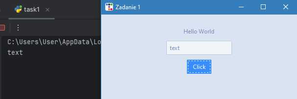
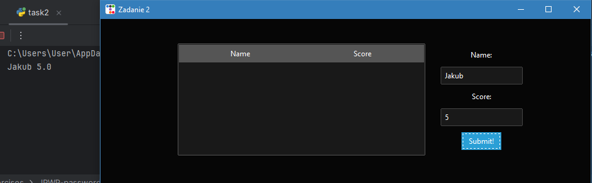
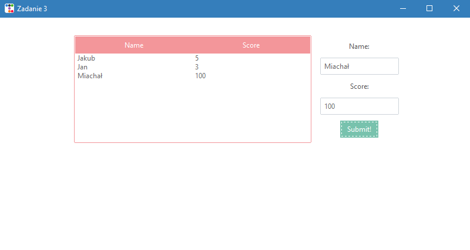
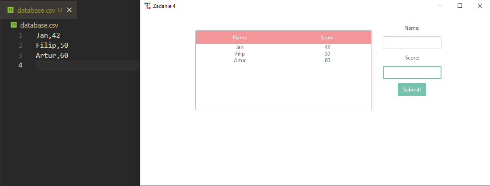
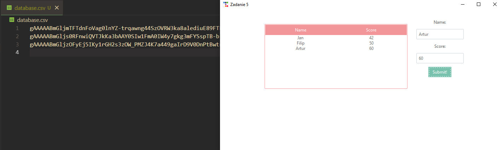

# Menedżer haseł w Tkinter - zadania
Aby wykonać poniższe zadania należy zainstalować dodatkowe moduły do python przy użyciu tej komendy:
```
pip install ttkbootstrap cryptography
```
<h4><u>Każde kolejne zadanie opiera się na zadaniu poprzednim, także należy robić je po kolei.</u></h4>

<h2>Zadanie 1</h2>
<h3>Stworzenie prostej aplikacji okienkowej</h3>

Zadanie to polega na stworzeniu aplikacji okienkowej przy użyciu biblioteki ttkbootstrap, która będzie zawierała widżety: `label`, `entry`, `button`. Kod należy napisać tak, żeby po kliknięciu przycisku w konsoli pokazywał się tekst, który został wpisany do pola tekstowego. Nazwa motywu do wykorzystania to: `morph`.
<br>
Najlepiej, żeby struktura kodu była w postaci klasy, tak jak  zostało to przedstawione na prezentacji.
<br><br>
Efekt powinien być następujący:


<br> 

Na UPel wyślij zdjęcie działającego GUI wraz z konsolą.


<h2>Zadanie 2</h2>
<h3>Dodanie treeview, entry i zmiana ustawienia widżetów.</h3>
<br>
Kod z poprzedniego zadania należy edytować w następujący sposób:

* Stworzyć dwa kontenery `frame`, które będą obok siebie.

* Do konteneru po lewej należy włożyć pusty widżet `treeview`, który będzie posiadał kolumny <b>Name</b> i <b>Score</b>.</li>

* Do konteneru po prawej należy umieścić widżety z poprzedniego zadania i dodać kolejne `entry`, które będzie przymojwało liczby.

* Przycisk ma wyświetlać w konsoli zawartość obu `entry`.

* Nad każdym `entry` powinien być `label`, który wskaże co ma się znaleźć w polu tekstowym.

* Nazwa motywu dla tego zadania to `"cyborg"`.
<br>
Efekt powinien być następujący:<br>

<br>
<br>
<b>Wskazówki:</b>
<br>
<i>Do umieszczenia widżeta obok widżeta, można użyć w pack `(side="left")`, na obu widżetach (<a href="https://www.pythontutorial.net/tkinter/tkinter-pack/">pomocny link</a>)</i>
<br>
<i>Do entry z liczbą lepiej nie używać `StringVar`, ale jego odpowiednika dla liczby `DoubleVar`.</i>
<br> 
<i>Pamiętaj o poprawnym wskazaniu parenta przy deklarowaniu widżeta!</i>
<br>

Na UPel wyślij zdjęcie działającego GUI wraz z konsolą.

<h2>Zadanie 3</h2>
<h3>Dodawanie elementów do treeview i toastNotification.</h3>

Kod z poprzedniego zadania należy edytować w następujący sposób:

* Należy zmodyfikować funkcję przycisku, żeby dodawała wpisy z pól tekstowych do `treeview`.
* Po dodaniu należy wywołać `toastNotification`, który wyświetli komunikat o poprawnym dodaniu elementu do `treeview`.
* Nazwa motywu dla tego zadania to `"minty"`
<br>
Efekt powinien być następujący:<br>

<br>
<br>
<b>Wskazówki:</b>
<br>
<i>Do obsługi `toastNotification` należy zaimportować `from ttkbootstrap.toast import ToastNotification`</i>
<br>
<i>Żeby `.insert()` mógł dobrze działać warto wskazać mu `treeview`, do którego ma wrzucić rzecz na przykład tak: `self.treeView = self.create_treeview()`</i>
<br>

Na UPel wyślij zdjęcie działającego GUI.


<h2>Zadanie 4</h2>
<h3>Dodanie bazy danych</h3>

Do poprzedniego programu dodaj klasę `Database`,która będzie zawierała funkcje `add_data` do dodawania wpisów do bazy danych oraz `get_data` do ich odczytywania. Wpisane przez nas dane powinny być przechowywane nawet po zamknięciu aplikacji.
Efekt modyfikacji powinien wyglądać w ten sposób:



<b>Wskazówki:</b>
<br>
<i>Funkcję `add_data` należy wywołać w `on_click_button`</i>
<br>
<i>Funkcję `get_data` należy wywołać w `create_treeview`</i>
<br>
Czytanie z pliku csv:

```
with open(filename, mode='r', newline='') as file:
    reader=csv.reader(file)
```
Zapisywanie do pliku csv:

```
with open(filename, mode='a', newline='') as file:
    writer = csv.writer(file)
    writer.writerow(your_data) #zapisywanie wiersza
```
Na UPel wyślij zdjęcie działającego GUI wraz z zawartością bazy danych po wprowadzeniu paru wpisów
<h2>Zadanie 5</h2>
<h3>Dodanie szyfrowania</h3>

Do funkcji `add_data` dodaj szyfrowanie, a do `get_data` dodaj deszyfrowanie. W bazie danych mają znajdować się jedynie zeszyfrowane dane. <br>
Ma to wyglądać w ten sposób:
<br>

<b>Wskazówki:</b>

Funkcje szyfrujące:

Generowanie klucza: tą funkcję wykonaj tylko <b>jeden raz</b> i zapisz wygenerowany klucz

```
key=Fernet.generate_key()
```
Przykładowa obsługa szyfrowania

```
cipher_app=Fernet(key)

message="wiadomość"
#Szyfrowanie
text_to_be_encrypted=message.encode()
text_encrypted=cipher_app.encrypt(text_to_be_encrypted)

#Deszyfrowanie
text_decrypted=cipher_app.decrypt(text_encrypted)
decrypted_message=text_decrypted.decode()
```
<b>Uwaga:</b>
czytanie z csv zwraca dane typu string, więc trzeba wykonać  `.decode()` zarówno na danych przekazywanych do bazy jak i tych odczytywanych do GUI.  <br><br>
Na UPel wyślij zdjęcie działającego GUI wraz z zawartością bazy danych po wprowadzeniu paru wpisów